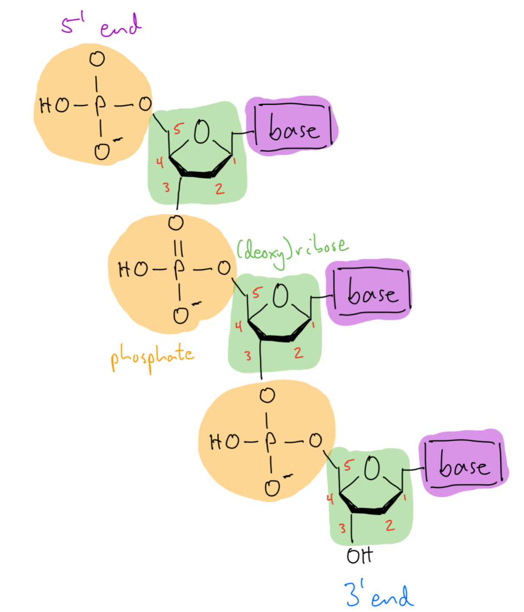

+++
title = "DNA to RNA + reverse complement"
date = 2024-11-18T11:49:50-05:00
description = "Let's solve the next couple problems in the ROSALIND series and implement two extremely common utilities in bioinformatics: transcribing DNA to RNA and taking the reverse complement of a sequence."
tags = ["bioinformatics", "go"]
categories = ["tutorials"]
series = ["rosalind"]
params.seriesentry = 2
+++

## Introduction

Welcome to the second entry in the ROSALIND problem series! Today we will be solving two problems: transcribing DNA to RNA and taking the reverse complement of a DNA sequence. This will let us learn some basics of efficient string manipulation in Go.

As always, solutions are in the associated [GitHub repo](https://github.com/carreter/rosalind-solutions).

## Problem 1: [Transcribing DNA into RNA](https://rosalind.info/problems/rna/)

[Transcription](https://en.wikipedia.org/wiki/Transcription_(biology)) is a core biological process which allows genetic information stored in double-stranded DNA to be copied into single-stranded RNA. This RNA can then serve as a message that is read by ribosomes during [translation](https://en.wikipedia.org/wiki/Translation_(biology)) in order to produce a protein. RNA has many other cellular functions, but let's focus on the task at hand!

## Solution 1

When a DNA sequence is transcribed into RNA, it remains identical except for the substition of all Ts (thymine) with Us (uracil). This should be pretty easy to implement! Let's start with a function signature which takes a `string` representing our DNA sequence and outputs a `string` representing the corresponding RNA sequence:

```go
func DNAToRNA(sequence string) string {
    // TODO: Implement this
}
```

We could from here simply iterate over the bases in `sequence` and append the RNA version of the base to a string that we then return:

```go
func DNAToRNA(sequence string) string {
    result := ""

    for _, base := range sequence {
        // Replace Ts with Us. Otherwise, simply copy over the base.
        if base == 'T' {
            result += "U"
        } else {
            // Convert base from a rune to a string before appending.
            result += string(base)
        }
    }

    return result
}
```

However, this would be very inefficient! In Go, the `string` type is immutable and *cannot be changed*. This means that we are creating a new `string` every time we add a base to our result, which involves a lot of unnecessary writing and rewriting of data.

That's where the `strings` package comes in to the rescue by providing us with the handy [`strings.Builder`](https://pkg.go.dev/strings#Builder) type, which allows us to efficiently build a string bit by bit. Let's rewrite our function to use it!

First, we'll want to import the `strings` module. The beginning of your Go file should look like this:

```go
package main

import (
    "fmt"
    "os"
    "strings"
)
```

Then, within our `DNAToRNA()` function, we'll first want to initialize an empty builder:

```go
builder := strings.Builder{}
```

The rest of the code will look very similar, except for two changes: (1) we will call `builder.WriteRune()` instead of appending to our result string, and (2) we will call `builder.String()` at the end of the function to build the final sequence.

Let's give it a shot:

``` go
func DNAToRNA(sequence string) string {
	// Initialize a builder to store the result in.
	builder := strings.Builder{}

	// Iterate over the sequence, replacing Ts with Us.
	for _, base := range sequence {
		if base == 'T' {
			builder.WriteRune('U')
		} else {
			builder.WriteRune(base)
		}
	}

	return builder.String()
}
```

And that's it! You can use similar code to what is described in the first entry in this series to read in the dataset and output the result.

## Problem 2: [Complementing a Strand of DNA](https://rosalind.info/problems/revc/)

As you probably already know if you've gotten this far in your biology journey, DNA consists of a double helix of two complementary strands of ribonucleuotides connected by phosphodiester bonds. Each strand also has an opposite directionality based on the configuration of these bonds. See the image below, and note that one end (5' end) is decorated with a phosphate group (in orange) and the other (3' end) has a hydroxyl group to which another phosphate base can be added to extend the strand. By convention, DNA is read in the 5' to 3' direction. 





This means that when we represent (double-stranded) DNA as a single string of bases, we are also implicitly encoding a complementary bottom strand. For example, the string `ACTCGCTCAGA` in reality looks more like this:

```text
5'-ACTCGCTCAGA-3' ("top" strand)
   |||||||||||
3'-TCAGCGAGTCT-5' ("bottom" strand)
```

The problem at hand is to determine the "reverse complement" of a DNA sequence. That is, given a top strand of bases in 5' to 3' order, what will the bottom strand look like if we also read it in 5' to 3' order?

Let's give it a shot!

## Solution 2

The two steps to our solution are given by the name of the problem: we need to first reverse the DNA string and then find the complement of each base.

As always, let's start with a function signature:[^1]

[^1]: You may have gathered by now that I am a fan of type-driven development. I've found thinking about the types of the inputs and outputs to a given function helps structure larger programs!

```go
func ReverseComplement(sequence string) string {
    // TODO: Implement this
}
```

As we did in our more efficient approach to problem 1, let's store our result in a `strings.Builder` and iterate over the input sequence. This time, however, we will iterate over the input *backwards* as we want to reverse it!

Then, all that's left to do is to add the complement of the given base to our output. Here's what that might look like:

```go
func ReverseComplement(sequence string) string {
	// Initialize a builder to store the result in.
    builder := strings.Builder{}

    // Iterate over the sequence in reverse, taking
    // the complement of each base.
    for i := len(sequence)-1; i >= 0; i-- {
        switch base := sequence[i]; base {
        case 'A':
            builder.WriteRune('T')
        case 'T':
            builder.WriteRune('A')
        case 'G':
            builder.WriteRune('C')
        case 'C':
            builder.WriteRune('G')
        }
    }

    return builder.String()
}
```

And that's it! Thanks for reading, and see you all next time :)

