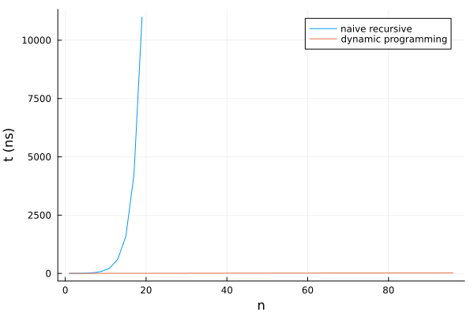

## Personal updates and future direction for the series

Hey all! Now that I've settled into my new position as a software engineer on
[Google Kubernetes Engine](https://cloud.google.com/kubernetes-engine) working on
scalable GPU/[TPU](https://en.wikipedia.org/wiki/Tensor_Processing_Unit) compute for
ML/AI training applications, I figured it'd be good to keep my bioinformatics/computational
biology skills sharp by resuming this series.

Most of the Kubernetes infrastructure I'll be working on at Google (e.g. some open-source
contributions to [JobSet](https://github.com/kubernetes-sigs/jobset)) will be in Go,
I will likely write this series in other languages going forward. I've also found myself
somewhat frustrated with Go's lack of expressivity and relatively limited
tooling for functional programming lately. [Julia](https://julialang.org/) has piqued
my interest, so I'll be trying a couple problems in it here.

Now let's get to it and solve some problems! Don't forget to check the [GitHub repo](https://github.com/carreter/rosalind-solutions) for full solutions if you get stuck.

## Problem 4: [Rabbits and Recurrence Relations](https://rosalind.info/problems/fib/)

The problem description gives an excellent overview of recurrence relations, so I won't
repeat it here. In short, we're being asked to do the following:

> **Given:** Positive integers \(n \leq 40\) and \(k \leq 5\)
>
> **Return:** The total number of rabbit pairs that will be present after \(n\) months,
> if we begin with 1 pair and in each generation, every pair of reproduction-age rabbits
> produces a litter of \(k\) rabbit pairs (instead of only 1 pair).

Let's try and describe this in mathematical notation, with \(F(n)\) representing the population
of rabbits (in _pairs!_) after \(n\) months.

We begin with 1 pair, so \( F(0) = F(1) = 1. \) In this case, rabbits reach reproductive age after
1 month; this means that on month \(n\) all rabbit pairs that were already alive at month
\(n-2\) will each produce \(k\) pairs of offspring, which get added to the previous month's
population. This lets us write the recurrence relation \[ F(n) = F(n-1) + kF(n-2). \]

### Naive solution

Once you have a recurrence relation and its base case written down, it's fairly straightforward
to implement it in code. Here's what this would look like in Julia:

```julia
function fib(n, k)
    if n ≤ 2
        1
    else
        fib(n-1, k) + k * fib(n-2, k)
    end
end
```


This naive solution, while quite straightforward to implement, has a significant weakness:
it performs quite poorly as \(n\) gets larger! Each recursive step makes two function
calls, which in turn make two function calls, resulting in an exponential explosion that
leaves us with a shockingly poor [runtime complexity](https://en.wikipedia.org/wiki/Computational_complexity_theory) of \(O\left(2^n\right)\).

### Dynamic programming solution

Let's take a different approach: instead of recursing *downward*, splitting the problem
into smaller and smaller chunks, let's iterate *upward* by starting from a simple case and
progressively build a solution (i.e.: use [dynamic programming](https://en.wikipedia.org/wiki/Dynamic_programming)).

In this problem, we only need to know what the current and previous months' populations
are to calculate the next month's value. Julia's [destructuring assignment](https://docs.julialang.org/en/v1/manual/functions/#destructuring-assignment) comes in handy here:
```julia
function fib_dp(n, k)
    if n ≤ 2
        return 1
    end

    prev = 1
    curr = 1
    for _ in 2:n
        prev, curr = curr, prev * k + curr
    end
    curr
end
```

This solution will run in a much faster \(O(n)\) time, as we only have to iterate up from 2 to \(n\) one time. It's a pretty shocking difference when plotted:



